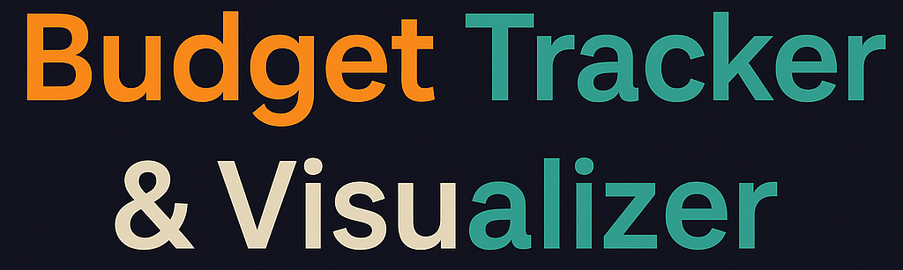
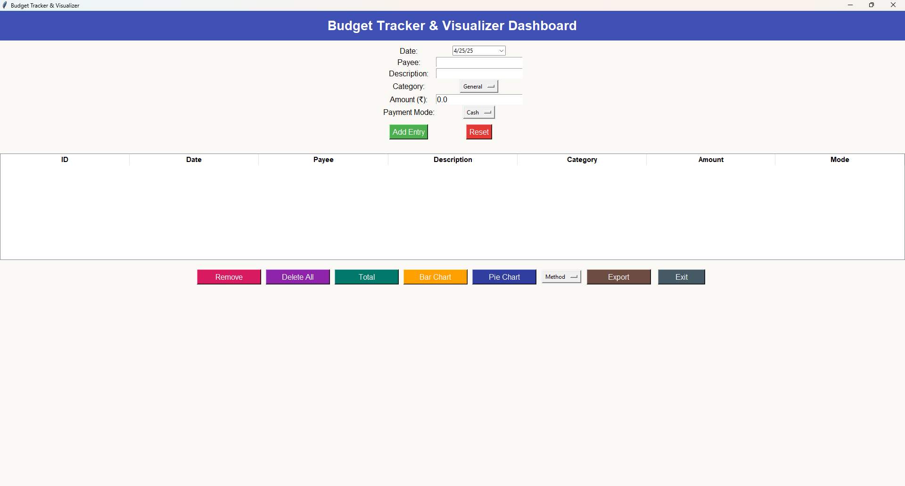

  

# 💼 Budget Tracker & Visualizer

A Tkinter-based GUI application to manage your daily expenses, visualize them with dynamic charts, and export reports into CSV, Excel, or PDF formats.  
Built for **personal finance tracking** in an easy and beautiful way! 🚀

---

## ✨ Features

- 📅 Add new expenses with date, purpose, cost, and payment method
- 📊 Visualize your spending with **Pie Chart** and **Bar Chart**
- 💾 Store data locally in **SQLite3 database**
- 📤 Export data to **CSV**, **Excel (.xlsx)**, and **PDF**
- 🔥 Stylish GUI with **Tkinter** and **emojis**
- 📈 Monthly/Receiver/Payment method trend analysis
- 📅 Integrated Calendar picker for dates

---

## 📸 Screenshots

| Dashboard (Form)             | Pie Chart (Spending Distribution)  |
|---------------------------------------|------------------------------------|
|  |  |

| Export Options                       | Bar Chart (By Payment Method)       |
|---------------------------------------|-------------------------------------|
|  |  |

---

## 🛠 Built With

- [Python 3.10+](https://www.python.org/)
- [Tkinter](https://docs.python.org/3/library/tkinter.html)
- [SQLite3](https://www.sqlite.org/index.html)
- [Pandas](https://pandas.pydata.org/)
- [Matplotlib](https://matplotlib.org/)
- [FPDF](https://pyfpdf.github.io/fpdf2/)
- [tkcalendar](https://github.com/j4321/tkcalendar)

---

## 📚 Future Enhancements

👥 User login system (multi-user support)

☁️ Cloud backup and sync

🔔 Spending limit alerts

📱 Mobile app version (Flutter/Kivy)

🎨 More advanced analytics with Plotly

---

